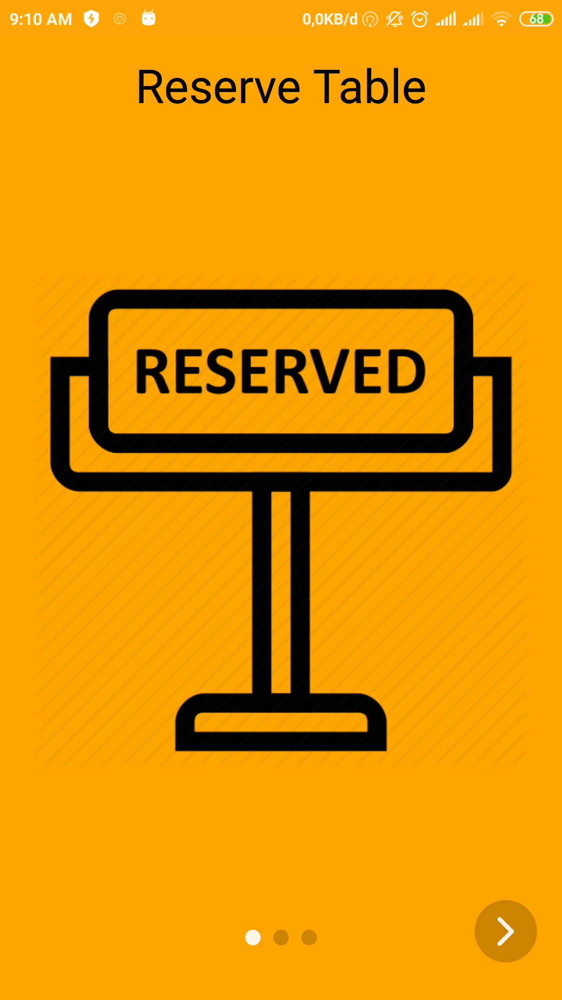
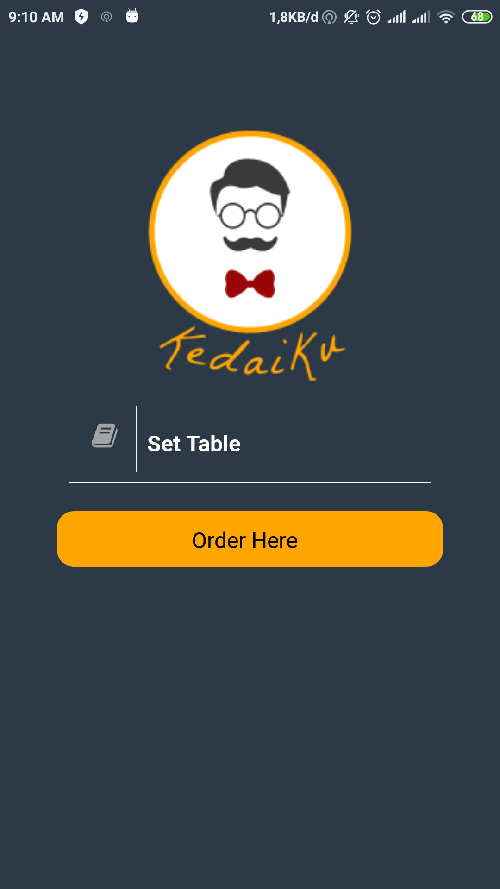
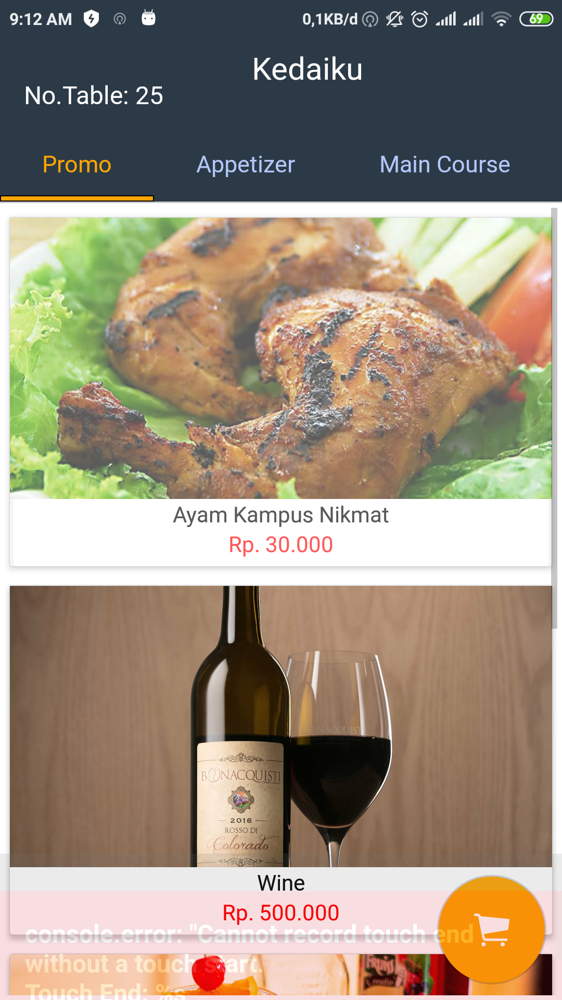
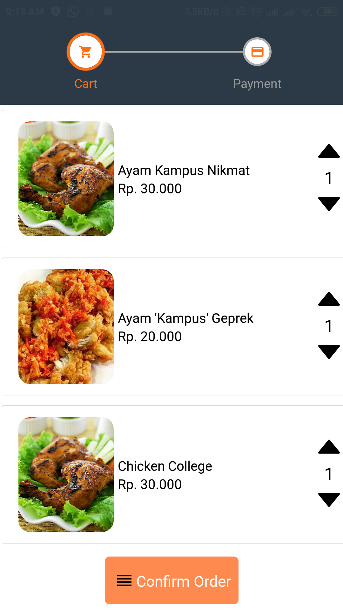
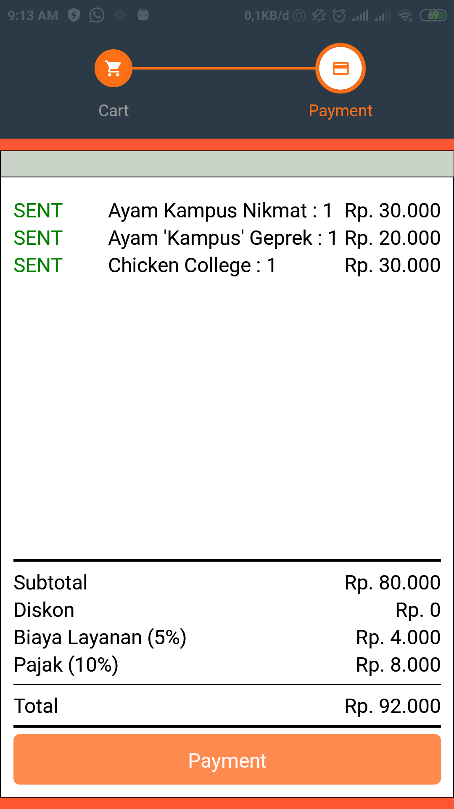
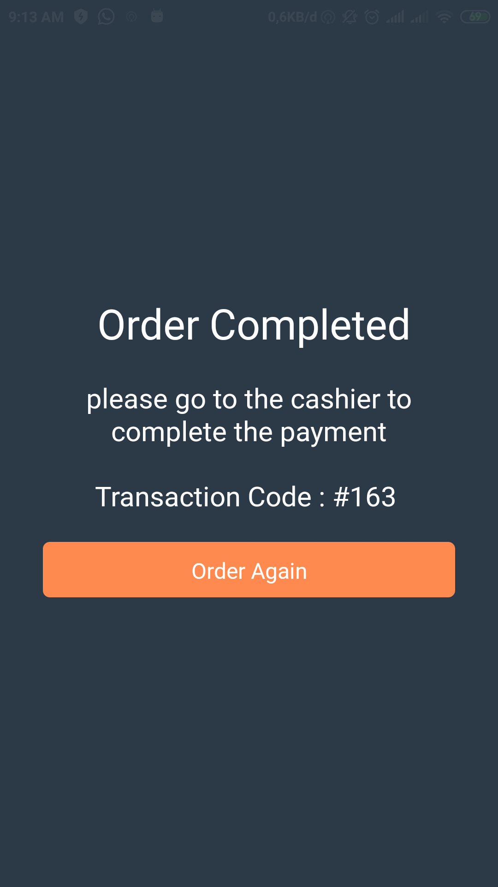

<h1 align="center">
  <br>
</h1>

## Important
This project is still on very early development stage. If you want to use for production, use it with your own risk.
<br>More feature Coming Really Soon.

## KedaiKu
KedaiKu is a food ordering application based on mobile apps

## Screenshots

<p float="left">
  

  

  

  
  
  
  
  
</p>


## Features
* Apps Guide
* Reserve table
* Order Menu
* Order Bill
* Payment


## Why Kedaiku?
* It's React Native, so it support android & iOS by default!
* Simple Code, so you can easily contribute on it.
* Easy to use

## Tech Stack
* React Native for the Mobile Client
* Express.js as the Server
* MYSQL for Database 

## Prerequisites
* Make sure You had been install NodeJs in your system https://nodejs.org/
* Then install React Native https://facebook.github.io/react-native/


## Installation & Configuration
Follow these step to install

**Server**

*Install and setup the backend server<br>
https://github.com/bedeljani/CloudAPI

**Client**
```
$ git clone https://github.com/bedeljani/RN-Resto.git
$ npm install
$ react-native run-android 
```


## Support Me :)
* Star this repository :star:
* Hire Me Abdel J Bengngu : https://www.linkedin.com/in/abdel-jb/

## Contact Me
* Abdel J Bengngu
  * WA/TELEGRAM: +6282117454646
  * email: abdeljulianbengngu@gmail.com


----
